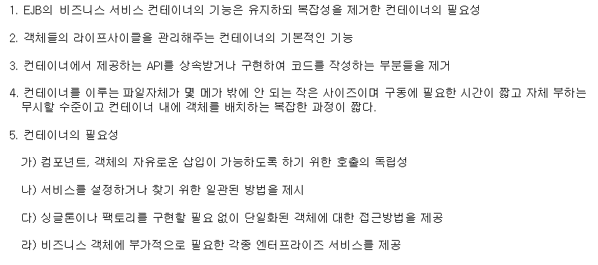
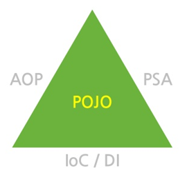
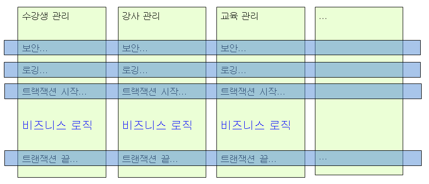
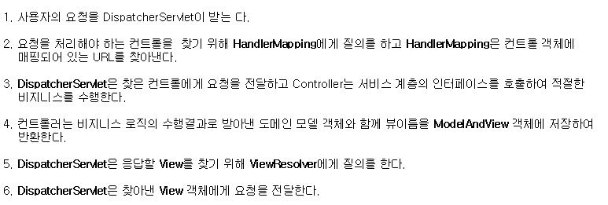

[TOC]

---

# Spring

Spring은 컨테이너라고 보면 됨!

자바가 많은 class로 되어있는데, 서로 의존성이 있고 복잡하고 막 그래서 힘들었는데

스프링 컨테이너가 대신 구성해주는 것 -> 객체 생명주기도 내가 관리해줄게!

## EJB(Enterprise Java Bean)

- was가 이 역할을 하기도 함 - 비즈니스/서블릿 객체 관리
- 근데 이거 복잡해

그래서 나온게 SPRING!

## Spring

**경량급** 

>  : 컨테이너 자체가 가볍다는게 아니라, EJB에 비해 가볍고, POJO(Plain Old Java Object) 특정클래스를 상속하거나 인터페이스를 구현하지 않는 평범한 자바 클래스(느슨한 Java Bean, Spring Bean)를 이용하며 단순하지만 EJB에서 제공하는 고급 기술을  제공

### Spring은 Container

---

### 전략

- POJO를 이용한 가볍고 비침투적 개발

  > GuestbookServlet extends HttpServlet { }
  >
  > `HttpServlet ` 이 기술을 우리 클래스에서 오버로드 하는걸 **기술침투**라고 함
  >
  > class Dao{ } : 여기서 connect JDBC 인터페이스 사용하는 것도 
  >
  > -> Dao에서는 JDBC인터페이스 기술을 사용하는 것
  >
  > ==> 우리가 만든 클래스들은 다른 기술을 사용하기에 재사용, 이식성이 떨어짐

- DI와 인터페이스 지향을 통한 느슨한 결합도

  > A가 B클래스를 상속 받을 때,
  >
  > class A { B b, getter, setter}
  >
  > class B { }
  >
  > A a = new A()
  >
  > B b = new B()
  >
  > a.setB(b)  
  >
  > 이런식으로 의존성을 해결하는데 --> DI라고함
  >
  > 이렇게 하면 결합도가 높은데, 
  >
  > 이런걸 컨테이너가 해결해줌! 
  >
  > A객체를 만들고 자기가 의존성 있는 객체를 잦아 A에 B를 주입해줌(setter 필요없음)
  >
  > 만약 클래스 B를 C로 바꾸고 싶을 때, 
  >
  > class A { I b }    --> b를 I인터페이스를 상속받게하고 I로하면
  >
  > 설정으로 C만 바꾸라고 하면 바꿔줌  -> 인터페이스 쓰면 느슨한 결합을 유지할수있음

- Aspect와 공통 규약을 통한 선언적(declarative) 프로그래밍

- Aspect 템플릿을 통한 반복적이고 상투적인 코드 제거 -> JDBC(pstmt, conn 같은)

---

## POJO - Plain Old Java Object

#### Spring Container에 들어가는 객체들은 전부 POJO

IoC[^Inversion of Control]Container : 대신해줌

> 코드 컨트롤(객체의 생성과 소멸)을 대신

DI[^Dependency Injection]  : 미리 찜해놓음

> 미리 선언하는 

**IoC(DI) Container  = Bean Factory = Application Context**

AOP[^Aspect-Oriented Programming]  : 관점지향

> Dao에서 SQL문빼고 나머지 공통 코드(연결, 예외처리, 로그작업)들이 겹쳐져서 복잡해짐
>
> 연결, 예외처리, 로그작업을 밖으로 빼서 설정에서 처리함
>
> 
>
> - 어떤 메소드에 어느 시점에 무엇을 실행할지 
> - 프록시같은 기술이 컨테이너에 만들어져서 AOP 지원을 해줌

---

Dispatcher Server -> Front Controller

톰캣이 /springex1로 오면 여기로 안내해주고

그다음 경로부터는 DispatcherServlet이 각각의 컨트롤러로 분리시켜줌

> 

---

------

## **스프링 순서**

------

### 1. init()

첫번째 Dispatcher Servlet에 요청이 들어오면 컨테이너 만

init { 

`ApplicationContext = new WebXmlApplicationContext('spring-servlet.xml ');`

하면 컨테이너를 만들어서 그 컨테이너가 spring-servlet.xml 파일을 스캐닝

-> 원래는 

spring-servlet.xml에서 `<bean> </bean>` 으로 클래스 지정했는데, @어노테이션으로함

Web과 관련된 bean이 있으니까

Web Application Context라고 함! 

}

1. 컨테이너 만듦
2. 스캐닝을 통해 메소드를 추출해 HandlerMapping 만듦
3. MAV객체 생성(Model And View)

#### HandlerMapping

| url    | controller객체           | Method 이름 | parameter    |
| ------ | ------------------------ | ----------- | ------------ |
| /hello | HelloController를 가리킴 | hello       | 파라미터정보 |

### 2. Service

### 3. doGet()

url = "/hello";

String viewName = HelloController.hello() 메소드 실행 

`viewName = "/WEB-INF/views/hello.jsp"`

뷰리절브한테 JSP v = vr.resolve(viewName) 이런식으로 JSP를 받아옴

그럼 v.render() 하면  render안에서 forwarding되면서 끝남

>  **ViewResolver**
>
> view이름을 주면 html을 만들수있는 view를 return

